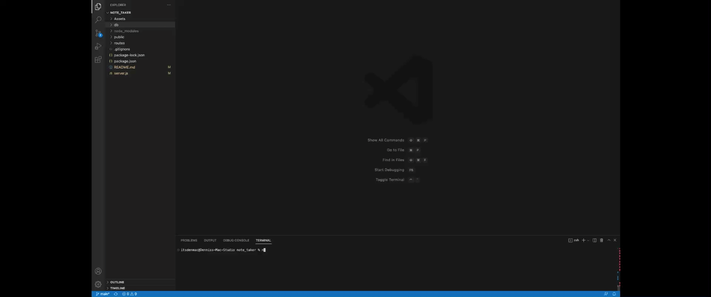
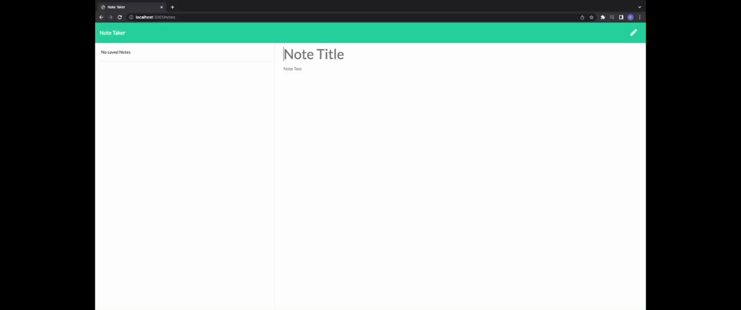
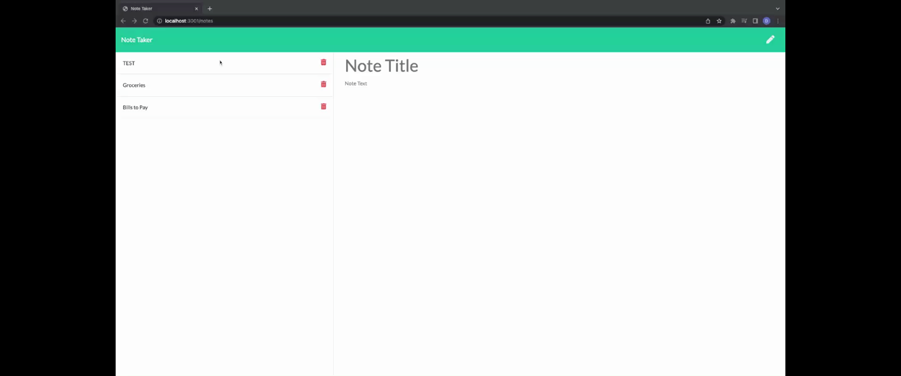
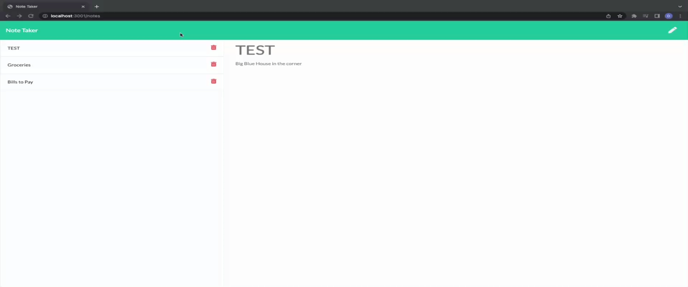

# note_taker
Note Taker is an application that can be used to write and save notes. This application uses Express.js back end and will save and retrieve note data from a JSON file.

## Installation

In able to execute the application, you will have to `git clone` the repository to your local storage. This will enable you to access all the files locally.

Run `npm install` in order to install the following npm package dependencies that are specified in the `package.json`, which are the following dependencie(s);
> `express`

> `mysql`

* The application will start once the user enters `npm start` in the command line.
* Application will provide a link to open up the application through a web browser. Such as: `http://localhost:3001`.

## Usage
* User will then be able to enter NOTE TITLE and NOTE TEXT.
* Once the user enters the following items, a save icon will appear on the top right of the application.
* After successfully saving your note, it will appear on the left side of the application and can be accessed for viewing.
* User will have the ability to delete previous notes by clicking the trash icon.

## Demo
* Installing necessaries dependencies and starting application through terminal

* Opening up the application through local host

* Adding and saving notes

* Switching to view saved notes

* Deleting notes that were previously created

## License 
Note Tracker project is licensed under ISC.

# QUESTIONS
For inquiries and/or questions:
 
GitHub: [itsDenMat](#itsDenMat)